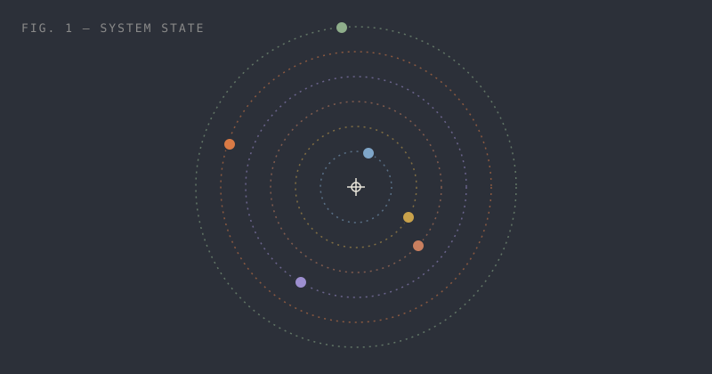

This transmission is a **draft**: it shows up when you run `npm run dev`, and it is left out of every production build. Keep it around as a cheat sheet for what the station can render.

## Text and emphasis

Plain paragraphs carry the weight. Use *italics* for emphasis, **bold** for strong emphasis, and ~~strikethrough~~ when the record should show the correction. Links look like [this one to the Flight Log](/log/), and inline code like `const phase = 'near'` sits on its own background.

Smart punctuation is automatic --- straight "quotes" become curly, and three dots... become an ellipsis.

## Lists

Unordered lists use square markers:

- Architecture before implementation
- Instrumentation before optimization
- Honest telemetry, always

Ordered lists count missions:

1. Design the risk framework
2. Fly on paper
3. Earn real capital

Task lists track checklists:

- [x] Rebuild the station as a static site
- [ ] Write twelve transmissions
- [ ] Find a Bortle-1 sky

### A third-level heading

Headings at level two and three appear in the **Contents** panel beside long posts.

## Quotes

> Even the fastest, most violent things in the universe are eventually shaped by drag — by the slow, patient medium they travel through.

## Code

```ts
// src/lib/orbits.ts — clock position → proximity
export function proximity(clock: string): number {
  const [h, m] = clock.split(':').map(Number);
  const deg = ((h % 12) + m / 60) * 30 - 90; // 12:00 = straight up
  return (1 - Math.sin((deg * Math.PI) / 180)) / 2;
}
```

```python
import numpy as np

def lorentz_factor(beta: float) -> float:
    """Bulk Lorentz factor for a jet moving at beta = v / c."""
    return 1.0 / np.sqrt(1.0 - beta**2)

print(f"{lorentz_factor(0.995):.2f}")  # ≈ 10.01
```

```bash
npm run new post "My next transmission"
npm run dev
```

## Tables

| Orbit   | Clock | State |
| ------- | ----: | ----- |
| Systems | 12:40 | Near  |
| Markets |  2:30 | Mid   |
| Astro   |  7:00 | Far   |

## Images

Put images next to the post (make the post a folder with an `index.md`) and reference them relatively:



## Footnotes

Orbits are only approximately circular.[^1]

[^1]: Kepler would like a word.

---

That horizontal rule above marks a section break.
